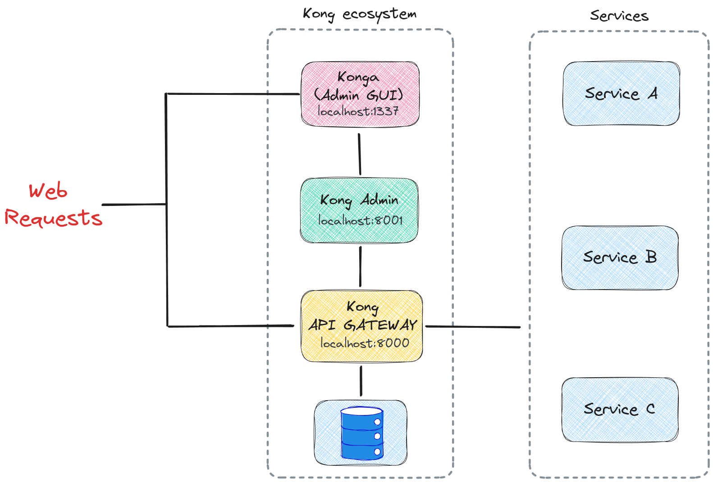

# Microservices Structure

## Table of Contents

- [About](#about)
- [Getting Started](#getting_started)
- [Usage](#usage)

## About <a name = "about"></a>

This repository contains the files needed to configure and run Kong as an API gateway, along with Konga to provide a graphical user interface (GUI) for API management.



## Getting Started <a name = "getting_started"></a>

To get started with this project, follow these steps:

1. **Clone the Repository**: Clone this repository to your local machine using the following command:
```bash
git clone https://github.com/fzaca/microservices-struct.git
cd microservices-struct
```

2. **Build the Docker images using Docker Compose:**:
```bash
docker-compose build
```

3. **Start the Docker services using Docker Compose**:
```bash
docker-compose up -d
```

4. **Access Konga GUI**: 
Open your web browser and navigate to http://localhost:1337 to access the Konga graphical user interface (GUI) for API management.


## Usage <a name = "usage"></a>

### Configuration with services.yml

The `services.yml` file is used to define the configuration for services within the Kong API gateway. It follows the format specified by the Kong Gateway configuration.

Example `services.yml` content:

```yaml
_format_version: "2.1"

services:
  - name: test-service
    host: test-service
    path: /api # Prefix api root
    port: 8000
    routes:
      - name: test-route
        paths:
          - /test
        strip_path: true
```
When you run the Docker Compose for the first time, this configuration will be executed to set up the services within Kong.

### Configuration data seed for Konga 

Seed data is used to prepopulate the Konga graphical user interface (GUI) with initial data, such as users and configurations.

Example `konga-node-seed.js` content:
```javascript
module.exports = [
    {
        "name": "Main",
        "type": "default",
        "kong_admin_url": "http://kong:8001",
        "health_checks": false,
    }
]
```

Example `konga-users-seed.js` content:
```javascript
module.exports = [
    {
        "username": "root",
        "email": "root@root.root",
        "firstName": "Root",
        "lastName": "Administrator",
        "node_id": "http://kong:8001",
        "admin": true,
        "active" : true,
        "password": "root1231"
    }
]
```

